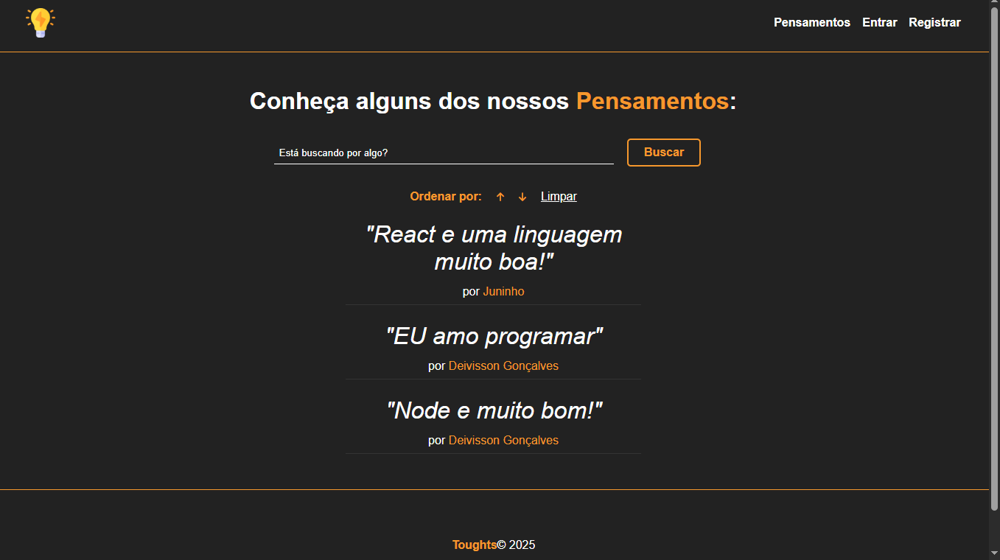
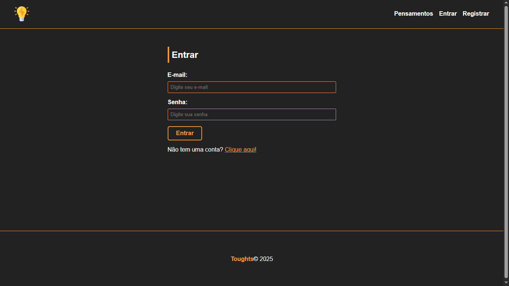
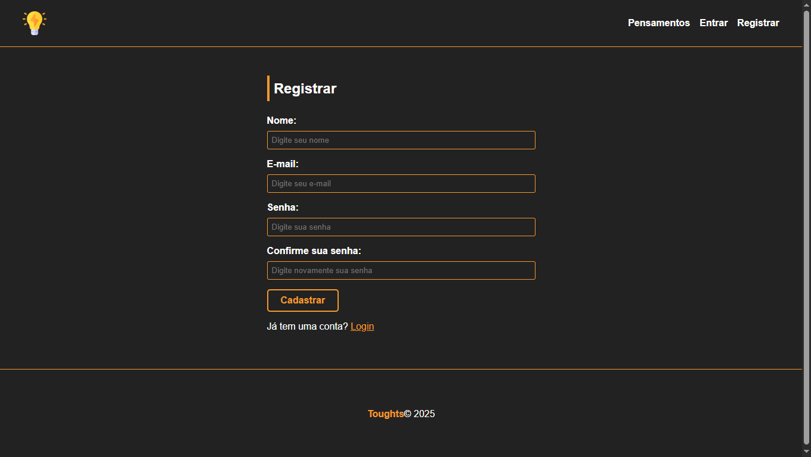
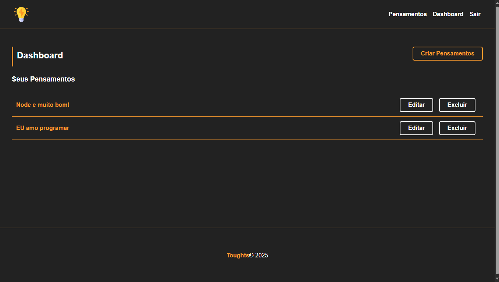

---

# Toughts

> Aplicação para registrar e compartilhar pensamentos de forma simples e elegante.


---

## Sobre

Toughts é uma plataforma web que permite aos usuários criar, visualizar e buscar pensamentos publicados por outras pessoas. O sistema conta com funcionalidades de autenticação, ordenação, busca e um painel administrativo para gerenciar conteúdos.

---

## Funcionalidades

* Registro e login de usuários
* Criação de pensamentos com títulos e textos
* Visualização de todos os pensamentos na página inicial
* Busca por pensamentos por palavras-chave
* Ordenação dos pensamentos por data (mais novos ou mais antigos)
* Controle de acesso com perfil de administrador
* Sistema de sessões para manter usuários logados

---

## Tecnologias usadas

* Node.js
* Express.js
* Sequelize 
* MySQL (Workbench) 
* Handlebars 
* bcryptjs 
* express-session e connect-sqlite3 
* outras libs auxiliares (flash, cors, etc.)

---

## Como usar

1. Clone este repositório:

   ```bash
   git clone https://github.com/deividev5/Toughts.git
   cd Toughts
   ```

2. Instale as dependências:

   ```bash
   npm install
   ```

3. Configure seu banco de dados e atualize as configurações no arquivo de conexão (`db/conn.js`).

4. Execute as migrations ou sincronize os modelos com o banco.

5. Inicie a aplicação:

   ```bash
   npm start
   ```

   *(Use nodemon para recarregamento automático durante o desenvolvimento)*

6. Acesse no navegador:

   ```
   http://localhost:3000
   ```

---

## Estrutura do projeto

```
├── controllers/      # Controladores das rotas
├── models/           # Modelos do banco de dados
├── routes/           # Arquivos de rotas
├── views/            # Templates Handlebars
├── public/           # Arquivos estáticos (CSS, JS, imagens)
├── db/               # Configuração do banco de dados
├── helpers/          # Funções auxiliares
├── index.js          # Arquivo principal do servidor
└── README.md         # Este arquivo
```

---

## Imagens do site


### Tela de login




### Tela de cadastro



### Tela de dashboard




## Licença

Este projeto está licenciado sob a licença MIT.

---

**Deivisson Gonçalves** | [GitHub](https://github.com/deividev5)

---


